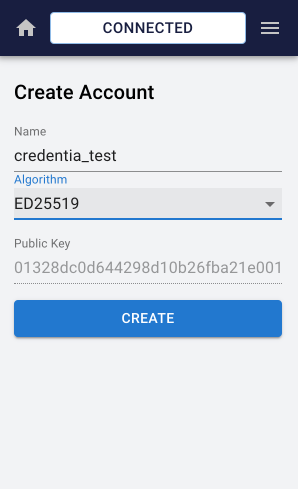
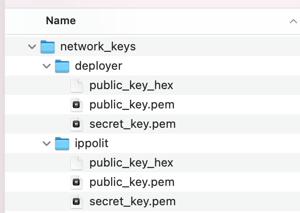
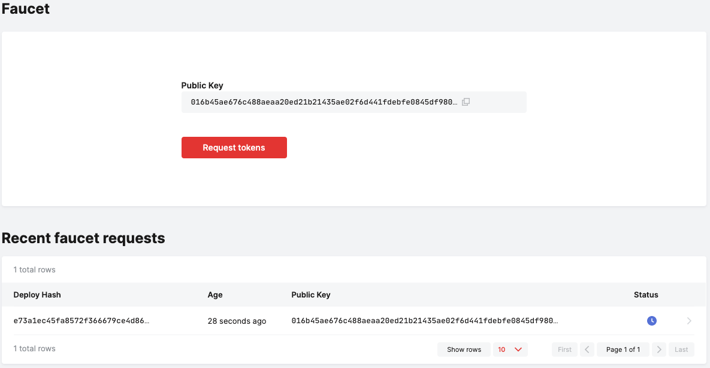

# Casper DID Smart Contract Guide

1. Install Rust
    1. Install Rust (if you don’t have it installed already). Please follow this document for installation guidelines: [https://www.rust-lang.org/tools/install](https://www.rust-lang.org/tools/install)
    2. Install wasm target builder. Please follow this document for installation guidelines: [https://www.hellorust.com/setup/wasm-target/](https://www.hellorust.com/setup/wasm-target/)
    3. Set "nightly" toolchain
    `bash
        > rustup update
        > rustup target add wasm32-unknown-unknown --toolchain nightly
    `

2. Build the project
```
    npm i
```

then

```
    npm build
```

3. Install casper signer [https://cspr.live/sign-in](https://cspr.live/sign-in)
    1. Follow user onboarding process until it prompts to create new account.
    2.
    3. Create a set of test accounts with the following names (this is just for demo, please keep names so that they match account names in demo scripts)
    4. Create <PROJECT>/network_keys folder with the following accounts subfolders in it:
        1. deployer
        2. ippolit
        3. victor
        4. Trent
    5. Generate keys for each of them with casper signer. Then in casper signer select menu -> key management and download key data into the appropriate folder for each account. There should be 3 files in each folder: public_key_hex, public_key.pem and secret_key.pem
    6. After all, the folder should look like this:

    

4. Request test tokens on [https://testnet.cspr.live/tools/faucet](https://testnet.cspr.live/tools/faucet) for each account
    1.

        

    2. Make sure you’ve received test tokens. It takes about 5 min for them to arrive (average block time in casper testnet is 3 min)
5. Deploy DID contract with the following command:
    1. node ./js/did/deploy_did.js
    2. A contract has been created:
```
Deploy CasperDIDContract hash: 28db52d6093e10a088103fef39d646b5c7fb203bf23d039c7d8f18bc4df778c

Contract Hash = hash-6a810712e737d78f1c57bb2123308cc08d16f61a67e804b3bba4325578b97e18
```

6. Copy a Contract hash value into <PROJECT>/js/constants.js under the CONTRACT_HASH key. It should look like this:
```
CONTRACT_HASH: "hash-6a810712e737d78f1c57bb2123308cc08d16f61a67e804b3bba4325578b97e18",
```
7. Let’s have fun testing contract now! :)
8. Register DID owner by invoking
```
  node ./js/did/transact_changeOwner.js
```

```
Change owner for Identity: da6f12be9c441060e5cc979d3995c60b8fcdcdb09f9765dcd110a19694013ada

new owner address: cdf55fa93276d59196ec24dcecdb817e5e372d758122fddba57fb80fcfc65384
```
9. Check the owner by invoking:
```
    node ./js/did/read_did.js
```


```
Read Owner for Trent

owner_identity: cdf55fa93276d59196ec24dcecdb817e5e372d758122fddba57fb80fcfc65384

Read Owner for Victor

owner_identity: da6f12be9c441060e5cc979d3995c60b8fcdcdb09f9765dcd110a19694013ada

delegate isn't instantiated

attribute isn't instantiated
```
10. Add attribute for identity:
```
    node ./js/did/transact_setAttribute.js
```
11. Read attributes for identity:
```
    node ./js/did/read_did.js
```
12. Add delegate for identity:
```
    node ./js/did/transact_setAttribute.js
```
13. Read delegates for Identity:
```
    node ./js/did/read_did.js
```
