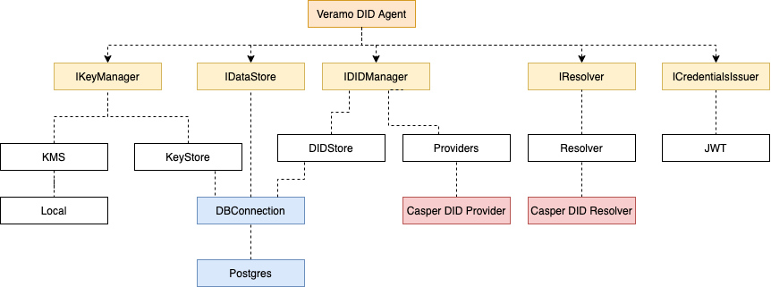

# Casper DID Documentation

# Introduction

Casper Self-Sovereign Identity Framework is created to make use of W3C [Verifiable Credentials Data Model 1.0](https://www.w3.org/TR/vc-data-model/) compliant documents, creating/managing W3C [Decentralized Identifiers (DIDs) v1.03 spec](https://www.w3.org/TR/did-core) compliant DIDs and more. The client SDK contains a library and tooling to interact with the Casper blockchain and a suite of tools to manage a full lifecycle of verifiable credentials.

## What is this all about?

Casper Self-Sovereign Identity Framework is the project intended to create base layer infrastructure over Casper Blockchain network that allows developers to make use and integrate Verifiable Credentials into their products (assuming these products are also Casper Blockchain based).

Features:

- Creating/Manipulating/Revoking DIDs derived from Casper blockchain addresses (and keys)
- Resolving Casper DIDs using Universal Resolver
- Creating/Revoking Verifiable Credentials

    ## What is it for?

Decentralized identifiers (DIDs) can be used in a variety of use cases, for example: no-password authentication. More information about use cases can be found [here](https://www.w3.org/TR/did-use-cases/). Here we provide a toolkit for creating and manipulating the DIDs created for Casper Blockchain network.

Verifiable Credentials (VC) is the digital document format that usually describes a fact about a subject or a relationship between different subjects, and is issued by the respective Issuer. When referencing to the Subjects or Issuer, VCs make use of DIDs (so requires for DIDs to be created before referenced in VCs). Also, VC verification procedure requires that Verifier validates all referenced DIDs to make sure they were valid as of the issuance date. DID validation process is called “resolution” and is performed with the help of a so-called DID resolver.

## Roadmap

Below is the project Implementation roadmap. Please note that the dates are approximate. We are working hard to stay with these dates.

- 08/2021 Roadmap, Whitepaper, Technical overview
- 09/2021 Casper DIDs (CRUR operations)
- 10/2021 Verifiable Credentials (CRUR operations + revocation lists)
- 10/2021 Demo application

    ## What we not do

Here we create a toolkit for using with the Casper Blockchain network. By default, this toolkit is not intended to be used for creating DIDs for methods other than “casper”. Same to DIDs, Verifiable credentials toolkit can be used only with Casper based DIDs.

The toolkit is based on opensource Veramo toolkit, which can be configured to use different DIDs and VC Storages by adding and configuring plugins. So, in case other DID methods or VC storages are required, they can be added manually by adding and configuring related Veramo plugins.

1. Design & Architecture

    ## Smart contracts Architecture

Casper Self-Sovereign Identity Framework is backed by a set of the smart contracts keeping the DID registry and VC revocation lists.


### CasperDID contract

Casper DID is a registry contract for DIDs. It’s main purpose is to store DID Attributes, Delegates and revoked DIDs. This contract allows users to self-declare ownership over DID and then checks for the valid owner for every operation related to this DID.

### CasperVCRevocationRegistry and RevocationRegistry contracts

This is the factory contract for creating and managing VC RevocationRegistry contracts. RevocationRegistry can be deployed by any users with the valid DID set as an owner. Then is users becomes a single operator of the revocation list and is the only allowed user to reference VCs in it (i.e. revoke VCs)

*Note:* It’s recommended that Issuers use a single RevocationRegistry per a VC type (or schema).

Veramo -> Casper DID Registry contract. Describe how

Data flow for verifiable credentials.

Presentation exchange (request -> verifiable credentials issuing -> validation)

## Universal resolver and Casper DID infrastructure
s
The Universal resolver is the service that is built on highly modular architecture and has already aggregated components (drivers) to access and read the majority of the existing DID methods. Casper DID infrastructure will also provide a driver that can be used with Universal Resolver so that DIDs backed by CasperDID contracts can be used by Universal resolver users.

## Casper Self-Sovereign Identity Framework SDK

Casper Self-Sovereign Identity Framework SDK is the JavaScript SDK based on Veramo SDK with 2 extra modules to access DID and VC data backed by Casper DID smart contracts. SDK is designed the way that it doesn’t override (fork) Veramo, but rather references existing implementation and embeds Casper-specific modules on initialization stage. The architecture of Veramo with Casper-specific modules is shown on the diagram below:



## On-chain infrastructure

**Casper TestNet:**

CasperDID: [https://testnet.cspr.live/deploy/42a30c6cf4f4343f0f99c295a945f1931386228dcc320407d854972a1bd524a3](https://www.notion.so/1386228dcc320407d854972a1bd524a3)

CasperVCRevocationRegistries:

**Casper Mainnet:**

CasperDID:

CasperVCRevocationRegistries:

*Note*: Valid Casper testnet nodes can be found here: [https://testnet.cspr.live/tools/peers](https://testnet.cspr.live/tools/peers)

#

1. Concepts

    ## DID

DID are essentially the Decentralized IDentifiers. DID are designed to be globally unique identifier that allow their respective owners (a.k.a. controllers) to prove they have a cryptographic control over them. DIDs might not be assigned to humans only, but reasonably to anything. According to [DID spec](https://www.w3.org/TR/did-core/),

`A DID identifies any subject (e.g., a person, organization, thing, data model, abstract entity, etc.) that the controller of the DID decides that it identifies.`

By its nature, DIDs are _persistent_, unlike public/private keys that might be rotated or changed when compromised. For DID this is not the case. DIDs remain unchanged even when associated keys are rotated. Essentially, DID might have multiple keys and any one of them can be rotated. Another point is that depending on the underlying standard, public keys could be of different size and format, but DIDs are usually much smaller and easier to use.

A DID Document is a data package associated with DID and includes the following data:

1. A subject
2. Public keys
3. Authentication scheme (used by subject)
4. Authorizations the subject has given to others
5. Service endpoints the one can communicate with the subject
6. etc.

Other properties that could be found in the DID document are listed here in [this section of the spec](https://www.w3.org/TR/did-core/#core-properties).

DIDs along with associated DID Documents are stored on the DID registry which can be backed by a centralized or decentralized database (a ledger).

The process of discovering the DID document for a DID is very similar to the process of discovering IP for DNS name and is called “resolution”. Likewise with DNS, a tool or a service that is doing resolution is called DID resolver. When resolving the DID, the Resolver is checking on which registry the DID is stored, then attempting to lookup for exact DID in the registry and extract associated data. The registry, access method, supported operations, underlying crypto standards and other related information is defined by the DID method of the DID. In case of Casper, the registry is the Casper blockchain, and the method is Casper.

An example Casper DID.

did:casper:013544b192ace929b6e1615328d1b3f79d57be81e9f88c5a74e8a8b9bba7080139

Above DID has method Casper and the DID identifier is 013544b192ace929b6e1615328d1b3f79d57be81e9f88c5a74e8a8b9bba7080139. Casper DID identifiers are 32 bytes in size (omitting the first byte which is a constant).

An example DID Document

```
{

"@context": "https://www.w3.org/ns/did/v1",

"id": "did:casper:013544b192ace929b6e1615328d1b3f79d57be81e9f88c5a74e8a8b9bba7080139",

"authentication": [

"did:casper:013544b192ace929b6e1615328d1b3f79d57be81e9f88c5a74e8a8b9bba7080139#keys-1"

],

"assertionMethod": [

"did:casper:013544b192ace929b6e1615328d1b3f79d57be81e9f88c5a74e8a8b9bba7080139#keys-1"

],

"publicKey": [

{

"id": "did:casper:013544b192ace929b6e1615328d1b3f79d57be81e9f88c5a74e8a8b9bba7080139#keys-1",

"type": "VerificationKey",

"controller": "did:casper:013544b192ace929b6e1615328d1b3f79d57be81e9f88c5a74e8a8b9bba7080139",

}

]

}
```

Note that Casper DIDs support only one key as of now. The key is present in the publicKey section. Note how that public key is referred to using its id in authentication and assertionMethod sections. The above document states that the DID did:casper:013544b192ace929b6e1615328d1b3f79d57be81e9f88c5a74e8a8b9bba7080139 authenticates with public key under publicKey. When it attests to some fact (becomes issuer, for example), it uses that key. Currently we have only one key supported for Casper DID method, so this only key is used for both authentication and assertionMethod.When support for multiple keys is added, the DID can specify which key(s) needs to be used for authentication and which ones for assertionMethod.

It’s important to understand that they keys associated with the DID might not be the keys used to send the transaction on chain (essentially, they are independent). A User might not have any blockchain tokens to write anything, but still is able to create a DID corresponding to his/her key and ask another User(Authority) to register his/her DID on chain. From the other side, when Authority recorded DID on chain, it cannot alter/remove it because only the User owns and controls the key associated with that particular DID.

1. Verifiable Credentials & Presentation
    1. Paper credentials vs Verifiable Credentials

In general, credentials are a part of a human's daily life. They are used to assert one capability of doing something, pretending to be someone, etc. Historically credentials were issued in a paper form and the process of verification was relying completely on “hard-to-reproduce” components of the paper document. The key point here is that verification was done by humans, so the security methods were relying on humans capability to read, verify and attest them. They were not designed to be attested by machines.

Using credentials in the digital world requires for them to be in machine readable form, so the security components should be “hard-to-reproduce” by machines, and attestation and verification methods to be suitable for machines primarily. Said that, when it comes to digital credentials design, it looks very intuitive that “asymmetric cryptography” was selected as a “hard-to-reproduce” security component and a JSON was selected as a representation form for digital credentials. Both components were designed to be operated by machines, not by humans. This all is summarized in the [Verifiable Credentials Data Model 1.0 (VCDM)](https://www.w3.org/TR/vc-data-model/) specification, which provides a standard approach to create, share and verify credentials in the digital space, in a way that they are machine readable, privacy respecting and cryptographically secure.

### Participants and workflow

- Credentials are issued by an **Issuer**.
- **Issuer** issues the credential about a **subject.** If the credential is revocable, the Issuer to specify a way revocation status must be checked. It is not necessary that revocation is managed by the issuer, the issuer might designate a different authority for revocation.
- **Issuer** sends the credential to the **holder**. (The **holder** might be the same as the **subject**)
- A **Verifier** is an entity willing to check if the **holder** possesses certain credentials. It requests a **presentation** about those credentials. To protect against replay attacks, (a verifier receiving the presentation and replaying the same presentation at some other verifier), a verifier must supply a challenge that must be embedded in the presentation.
- **Holder** creates a **presentation** for the requested credentials. The **presentation** must indicate which credentials it is about and must be signed by the **holder** of the credentials.
- When a presentation is received by the **Verifier**, it checks whether the presentation contains the signature from the **holder** on the presentation and the challenge. Then, the validity of each credential in the **presentation** is checked. This includes:
    - validating the correctness of the data model of the credential (schema)
    - the authenticity (by verifying the issuer's signature)
    - revocation status (if the credential is revocable)
        1. Issuing Verifiable Credentials

In order to issue a Verifiable Credential (VC), the Issuer to have a “well-known” public key (a Certificate) that is accessible by the holder and verifier to verify the credentials digital signature with. Issuer is specified by its DID, which is present in the credential in the issuer field. Below is an example of the VC document with Issuer and proof specified.

```
{

'@context': [

'https://www.w3.org/2018/credentials/v1',

'https://www.w3.org/2018/credentials/examples/v1'

],

id: '0x9b561796d3450eb2673fed26dd9c07192390177ad93e0835bc7a5fbb705d52bc',

type: [ 'VerifiableCredential', 'AlumniCredential' ],

issuanceDate: '2021-04-20T08:23:24Z',

credentialSubject: {

id: 'did:casper:6174cf2e6f8fed1715c9a3bace9c50bfe572eecb763b0ed3f644532616452008,

alumniOf: 'Example University'

},

issuer: 'did:casper:013544b192ace929b6e1615328d1b3f79d57be81e9f88c5a74e8a8b9bba7080139',

proof: {

type: 'Ed25519Signature2018',

created: '2021-04-20T08:23:24Z',

jws: 'iJFHJDYEHS:LKDZERTQSIsImI2NCI6ZmFsc2UsImNyaXQiOlsiYjY0IlyaiTMhVt4R5P2bMGcLNJPWEUq7WmGHG7Wc6mKBo9k3vSo7v7sRKwqS',

proofPurpose: 'assertionMethod',

verificationMethod: 'did:casper:6174cf2e6f8fed1715c9a3bace9c50bfe572eecb763b0ed3f644532616452008#keys-1'

}

}
```

### Verifiable Presentation

The Presentation is created by the Holder and is signed with his/her private key. For the Verifier to verify the presentation, this signature must be verified as well as Issuer’s signature. For doing this, a Verifier to know the Holder’s public key. A natural way to achieve this is to ensure the Holder uses DID for self identification, which can be independently resolved by the Verifier and public key data can be extracted from corresponding DID document.

An example presentation signed by the holder:

```
{

'@context': [ 'https://www.w3.org/2018/credentials/v1' ],

type: [ 'VerifiablePresentation' ],

verifiableCredential: [

{

'@context': [

'https://www.w3.org/2018/credentials/v1',

'https://www.w3.org/2018/credentials/examples/v1'

],

id: '23423rwerw9e87r8',

type: [ 'VerifiableCredential', 'AlumniCredential' ],

issuanceDate: '2021-04-20T08:23:27Z',

credentialSubject: {

id: 'did:casper:6174cf2e6f8fed1715c9a3bace9c50bfe572eecb763b0ed3f644532616452008',

alumniOf: 'Example University'

},

credentialStatus: {

id: 'rev-reg:casper:0194db371bab472a9cc920b5dfb1447aad5a6db906c46ff378cf0fc337a0c8c0',

type: 'CredentialStatusList2017'

},

issuer: 'did:casper:013544b192ace929b6e1615328d1b3f79d57be81e9f88c5a74e8a8b9bba7080139',

proof: {

type: 'Ed25519Signature2018',

created: '2021-04-20T08:23:27Z',

jws: 'eiwurpadlgudkDGOIDd.asdjhasdf.kjyqlekjyrlkjahkdsufhliuqhiuahsd..aosiuuaaJHSJYJGDo',

proofPurpose: 'assertionMethod',

verificationMethod: 'did:casper:013544b192ace929b6e1615328d1b3f79d57be81e9f88c5a74e8a8b9bba7080139#keys-1'

}

}

],

id: '0x2762387694872693837643728687dcba7e88ce11c2312c02df562754f1',

proof: {

type: 'Ed25519Signature2018',

created: '2021-04-22T08:22:27Z',

challenge: '0x238467982736948762198376492837948238749283742eb878456babf49b9a6669d0b76',

domain: 'test domain',

jws: 'eiwurpadlgudkDGOIDd.asdjhasdf.kjyqle8e5ir5RvCg',

proofPurpose: 'authentication',

verificationMethod: 'did:casper:6174cf2e6f8fed1715c9a3bace9c50bfe572eecb763b0ed3f644532616452008#keys-1'

}

}
```

### Revocation status

In case the credentials are revocable, the Issuer has to specify how the revocation status must be checked in the credentialStatus field. On Casper, the revocation is managed with the appropriate on-chain revocation registry for a specified Verifiable Credentials type. Such registry is identified by its ID and the Issuer embeds this ID in the credentialStatus field. An example of the credentials with revocation registry data:

```
{

'@context': [

'https://www.w3.org/2018/credentials/v1',

'https://www.w3.org/2018/credentials/examples/v1'

],

id: '234720319827309487192038749827398',

type: [ 'VerifiableCredential', 'AlumniCredential' ],

issuanceDate: '2021-04-20T08:23:27Z',

credentialSubject: {

id: 'did:casper:6174cf2e6f8fed1715c9a3bace9c50bfe572eecb763b0ed3f644532616452008',

alumniOf: 'Example University'

},

credentialStatus: {

id: 'rev-reg:casper:0194db371bab472a9cc920b5dfb1447aad5a6db906c46ff378cf0fc337a0c8c0',

type: 'CredentialStatusList2017'

},

issuer: 'did:casper:013544b192ace929b6e1615328d1b3f79d57be81e9f88c5a74e8a8b9bba7080139',

proof: {

type: 'Ed25519Signature2018',

created: '2021-04-22T08:22:27Z',

jws: eiwurpadlgudkDGOIDd.asdjhasdf.kjyqle8e5ir5RvCg',

proofPurpose: 'assertionMethod',

verificationMethod: 'did:casper:6174cf2e6f8fed1715c9a3bace9c50bfe572eecb763b0ed3f644532616452008#keys-1'

}

}
```

In order to revoke a Verifiable Credentials, the revoking Authority (usually - an Issuer itself) references credentials ID in the revocation registry. When the revocation status of the credential is verified, this ID of the credentials along with the ID of the revocation registry are specified in a query. In case a record found in a registry, the Credentials are considered as revoked.

Technically, revocation can be undone by the revoking Authority if the registry supports such operation. So, revocation status should not be treated as permanent and should be queried from the registry every time Verifiable Credentials are validated.
