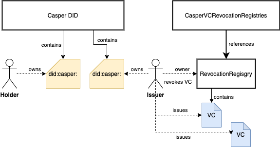

# Infrastructure and development framework for self-sovereign identity app developers on Casper Networ

## Quick Navigation

Whitepaper: [**The Concept of Self-Sovereign Identity in the Web3 Context**](https://github.com/credentia-network/Docs/commit/23fec27926ecf96803a07fb28951ab08b4f48d61)

[Casper SSI Framework General document](readme/casper-ssi-framework/)

[Casper DID method specification](readme/casper-did-method-spec.md)

[Using Casper DID smart contract. Step-by-step guide](readme/smart-contract.md)

[Casper DID Registry Smart contract API](readme/API-DIDRegistry.md)

[Casper VC Registry Smart contract API](readme/API-VCRegistry.md)

[Casper SSI Framework DEMO WEB APP](readme/demo-web-app.md)

## Introduction

Our goal is to enable developers to create trusted data exchange systems on top of Casper Network. We're simplifying development of digital identity and digital authenticated documents for any external developer. The resulting solution must provide tools for developers to generate and manage digital identities (DIDs) and documents (VCs). The solution contains:

* off-chain backend logic
* smart contracts on Casper Network
* documentation
* frontend demo applications (WIP)
* Verifiable Credentials SDK (WIP)

The solution is publicly available on GitHub under MIT license.

## Architecture

## **Customer personas**

### **Developers**

Software engineers will be using smart contracts, SDK and documentation to build applications for end customers (identity holder, verifiable credentials issuers and verifiers). Developers are looking to bootstrap their development effort by utilizing the SDK. Developers need to have clear, simple and easy to follow documentation and code samples.

### **Business Customers**

Business customers won’t be using SDK directly. Their goal is to understand how SSI technology works and what are its potential applications. Business customers will be looking at demo applications to understand use cases for the decentralized digital identity and verifiable credentials.
