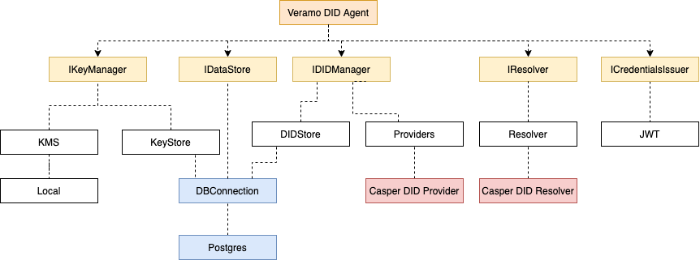

# Design & Architecture

## Design & Architecture

### Smart contracts Architecture

Casper Self-Sovereign Identity Framework is backed by a set of the smart contracts keeping the DID registry and VC revocation lists.

#### CasperDID contract

Casper DID is a registry contract for DIDs. It’s main purpose is to store DID Attributes, Delegates and revoked DIDs. This contract allows users to self-declare ownership over DID and then checks for the valid owner for every operation related to this DID.

#### CasperVCRevocationRegistry and RevocationRegistry contracts

This is the factory contract for creating and managing VC RevocationRegistry contracts. RevocationRegistry can be deployed by any users with the valid DID set as an owner. Then is users becomes a single operator of the revocation list and is the only allowed user to reference VCs in it (i.e. revoke VCs)

_Note:_ It’s recommended that Issuers use a single RevocationRegistry per a VC type (or schema).

Veramo -> Casper DID Registry contract. Describe how

Data flow for verifiable credentials.

Presentation exchange (request -> verifiable credentials issuing -> validation)

### Universal resolver and Casper DID infrastructure

The Universal resolver is the service that is built on highly modular architecture and has already aggregated components (drivers) to access and read the majority of the existing DID methods. Casper DID infrastructure will also provide a driver that can be used with Universal Resolver so that DIDs backed by CasperDID contracts can be used by Universal resolver users.

### Casper Self-Sovereign Identity Framework SDK

Casper Self-Sovereign Identity Framework SDK is the JavaScript SDK based on Veramo SDK with 2 extra modules to access DID and VC data backed by Casper DID smart contracts. SDK is designed the way that it doesn’t override (fork) Veramo, but rather references existing implementation and embeds Casper-specific modules on initialization stage. The architecture of Veramo with Casper-specific modules is shown on the diagram below:

### On-chain infrastructure

**Casper TestNet:**

CasperDID: [https://testnet.cspr.live/deploy/42a30c6cf4f4343f0f99c295a945f1931386228dcc320407d854972a1bd524a3](https://testnet.cspr.live/deploy/42a30c6cf4f4343f0f99c295a945f1931386228dcc320407d854972a1bd524a3)

CasperVCRevocationRegistries:

**Casper Mainnet:**

CasperDID: 57723a54672fe584293daed7e4b98d1cf1936a982043ff50888a8763c3d97d3f

CasperVCRevocationRegistries:

_Note_: Valid Casper testnet nodes can be found here: [https://testnet.cspr.live/tools/peers](https://testnet.cspr.live/tools/peers)

##
